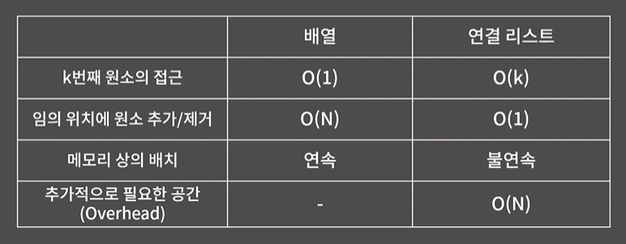

### 연결 리스트의 성질
 
 

1. k번째 원소를 확인/변경하기 위해 O(k)가 필요
2. 임의의 위치에 원소를 추가/임의 위치의 원소 제거는 O(1)
3. 원소들이 메모리 상에 연속해있지 않아 Cache hit rate는 낮지만 할당이 다소 쉬움
 
 

### 연결 리스트의 종류
 
 

단일 연결 리스트(다음의 원소에만 연결)

이중 연결 리스트(각 원소끼리 연결)

원형 연결 리스트(끝이 처음과 연결)

 
 

### 배열 vs 연결 리스트
 
 

